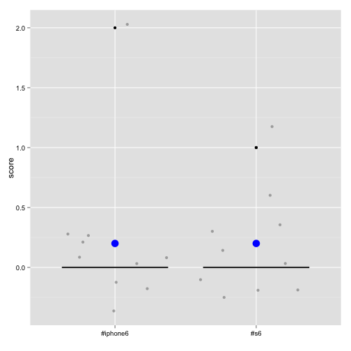

### Presentation on "Twitter - Sentiment Analysis"
---
#### A Shiny App by kwektuanze

---

### App Introduction
---
1. Pull tweets of two given words (hashtag, handle supported) and apply sentiment scoring algorithm.

2. Generate box plots of the distribution and mean of scores, for sentiment analysis of the two words.

> Let's see an example of #iphone6 vs. #s6

--- &twocol w1:60% w2:40%
### 1. Sentiment Scoring Algorithm
---
*** =left
#### Subset of R code

```r
library(plyr)
library(stringr)
library(tm)
library(twitteR)

#Twitter OAuth with token cache
origop<-options("httr_oauth_cache")
options(httr_oauth_cache=TRUE)
setup_twitter_oauth("jhDUfOPgDrov0Vcn5IodKa0iN", "FXjD6OWwUEjJtNxuCXhkPglKCAYHdUO2i3kogs8PZBxoBnW3gB", "3163543724-Rs8hQpHN79iK5qCVfFADFAJyNqUhvOsye6KkrxX", "BvF2Cb6JikThKxEAG70HjPEYKQBDlk4CWA8eieb37QuAz")
options(httr_oauth_cache=origop)

#Tweets search and return resultant data frame
searchTweets<-function(searchWord, maxTweets) {
  searchResult<-searchTwitter(searchWord, n=maxTweets, lang="en")
  searchResultDf<-do.call("rbind", lapply(searchResult, as.data.frame))
  searchResultDf$text<-iconv(searchResultDf$text, 'UTF-8', 'ASCII')
  return(searchResultDf)
}

#Data preparation on tweets
cleanTweets<-function(tweets) {
  #Remove spaces
  tweets<-str_replace_all(tweets, " ", " ")
  #Remove URLs
  tweets<-str_replace_all(tweets, "http://t.co/[a-z,A-Z,0-9]*{8}", "")
  #Remove retweet header
  tweets<-str_replace(tweets, "RT @[a-z,A-Z]*: ", "")
  #Remove hashtags
  tweets<-str_replace_all(tweets, "#[a-z,A-Z]*", "")
  #Remove screen name references
  tweets<-str_replace_all(tweets, "@[a-z,A-Z]*", "")
  return(tweets)
}

#Scoring sentiment based on Jeffrey Breen's algorithm: https://jeffreybreen.wordpress.com/2011/07/04/twitter-text-mining-r-slides
score.sentiment = function(sentences, pos.words, neg.words) {
  
  scores = laply(sentences, function(sentence, pos.words, neg.words) {
    # clean up sentences with R's regex-driven global substitute, gsub():
    sentence = gsub('[[:punct:]]', '', sentence)
    sentence = gsub('[[:cntrl:]]', '', sentence)
    sentence = gsub('\\d+', '', sentence)
    # and convert to lower case:
    sentence = tolower(sentence)
    
    # split into words. str_split is in the stringr package
    word.list = str_split(sentence, '\\s+')
    # sometimes a list() is one level of hierarchy too much
    words = unlist(word.list)
    
    # compare our words to the dictionaries of positive & negative terms
    pos.matches = match(words, pos.words)
    neg.matches = match(words, neg.words)
    
    # match() returns the position of the matched term or NA
    # we just want a TRUE/FALSE:
    pos.matches = !is.na(pos.matches)
    neg.matches = !is.na(neg.matches)
    
    # and conveniently enough, TRUE/FALSE will be treated as 1/0 by sum():
    score = sum(pos.matches) - sum(neg.matches)
    
    return(score)
  }, pos.words, neg.words)
  
  scores.df = data.frame(score=scores, cleaned_tweets=sentences)
  return(scores.df)
}

#Sentiment analysis
sentimentAnalysis<-function(word1tweets, word2tweets, word1, word2) {
  
  #List of positive and negative words from Jeffrey Breen's GitHub: https://github.com/jeffreybreen/twitter-sentiment-analysis-tutorial-201107/tree/master/data/opinion-lexicon-English
  positivewords=readLines("positive_words.txt")
  negativewords=readLines("negative_words.txt")
  
  #Apply score.sentiment algorithm
  word1score=score.sentiment(cleanTweets(word1tweets), positivewords, negativewords)
  word2score=score.sentiment(cleanTweets(word2tweets), positivewords, negativewords)
  
  #Add labels [word1] and [word2] for ggplot of the analysis
  word1score$word=word1
  word2score$word=word2
  
  #Combine scores
  sentimentScores<-rbind(word1score, word2score)
}

#Read word 1 and word 2, and search the related tweets
searchResult1<-searchTweets("#iphone6", 10)
searchResult2<-searchTweets("#s6", 10)

#Create sentiment scores
sentimentScores<-sentimentAnalysis(searchResult1$text, searchResult2$text, "#iphone6", "#s6")
```

*** =right
#### Results of the two words 

```
##    score     word
## 1      0 #iphone6
## 2      0 #iphone6
## 3      0 #iphone6
## 4      0 #iphone6
## 5      0 #iphone6
## 6      0 #iphone6
## 7      2 #iphone6
## 8      0 #iphone6
## 9      0 #iphone6
## 10     0 #iphone6
## 11     0      #s6
## 12     0      #s6
## 13     0      #s6
## 14     0      #s6
## 15     1      #s6
## 16     0      #s6
## 17     0      #s6
## 18     0      #s6
## 19     1      #s6
## 20     0      #s6
```

---
### 2. Box plot of the distribution and mean of scores
---

```r
ggplot(sentimentScores, aes(x=word,y=score,fill=word))+geom_boxplot()+geom_jitter(alpha=.3)+
  theme(axis.text.x = element_text(color="black"))+theme(axis.text.y = element_text(color="black"))+theme(legend.position="none")+labs(x="")+
  stat_summary(fun.y=mean, geom="point",color="blue", size=5)
```

 

---
### Conclusion and more
---
<span style="font-size:20px">The box plot shows the distribution of sentiment scores about each word on Twitter. For each tweet, a net score of positive (> 0), negative (< 0) or neutral (= 0) sentiments is calculated. Blue dots are mean sentiment scores for the two words. We can see the sentiments for Apple iPhone 6 (#iphone6) and Samsung S6 (#s6) are generally positive and similar.</span>
<hr></hr>
* <span style="font-size:28px">Hope the example interests you to explore more :)</span>
* <span style="font-size:28px">Please visit my shiny app:<br />
[https://kwektuanze.shinyapps.io/Developing_Data_Products_Course_Project](https://kwektuanze.shinyapps.io/Developing_Data_Products_Course_Project)</span>
* <span style="font-size:28px">Code shared on github:
[https://github.com/kwektuanze/Developing_Data_Products_Course_Project](https://github.com/kwektuanze/Developing_Data_Products_Course_Project)</span>

> Thank you!
